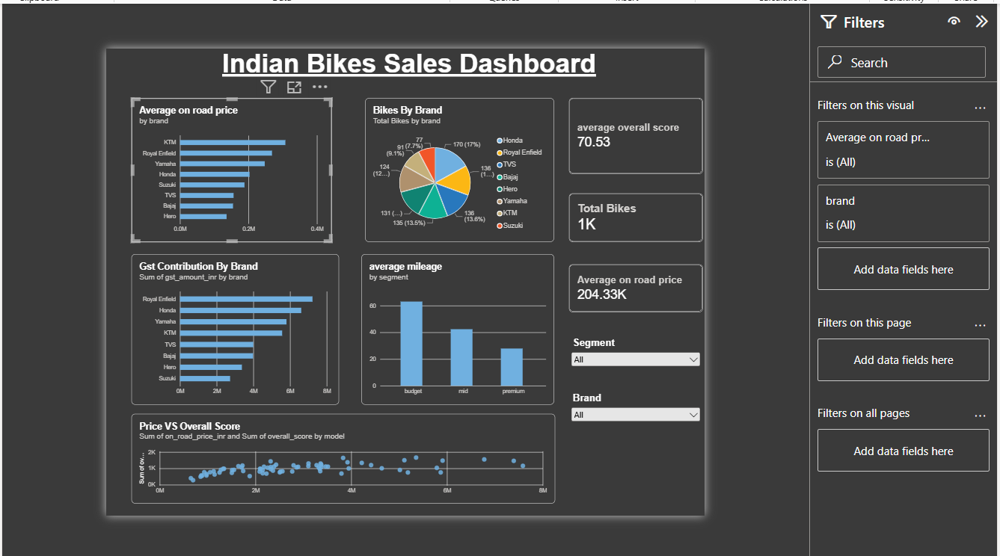

## 📌 Project Overview

This project is an interactive Power BI dashboard created to analyze Indian bike data across different brands, segments, pricing, mileage, overall scores, and GST contribution.

The dashboard allows users to interact with the data using Brand, Segment, and Year filters.

## 🎯 Objectives

- Analyze bike prices across different brands
- Compare mileage across bike segments
- Understand the distribution of bikes by brand
- Analyze GST contribution by brand
- Explore the relationship between bike price and overall score
- Create an interactive and user-friendly Power BI dashboard

## 🛠️ Tools & Technologies

- Power BI
- Data Visualization
- Data Analysis
- DAX

## 📊 Dashboard Features

### KPI Metrics
- Total Bikes
- Average Mileage
- Average On-Road Price
- Average Overall Score

### Visualizations
- Average On-Road Price by Brand
- Average Mileage by Segment
- Bikes by Brand
- GST Contribution by Brand
- Price vs Overall Score

### Interactive Filters
- Brand
- Segment
- Year

## 📷 Dashboard Preview

## 💡 Key Analysis Areas

The dashboard provides an overview of bike pricing, mileage, brand distribution, GST contribution, and the relationship between price and overall score.

Users can apply different filters to explore the data from different perspectives.

## 📁 Project Files

- `Indian_Bike_Sales_Dashboard.pbix` — Power BI dashboard file
- `Indian_Bike_Sales_Dashboard.png` — Dashboard preview

## 🚀 Conclusion

This project demonstrates the use of Power BI to transform bike-related data into an interactive dashboard that can support data exploration and business analysis.
